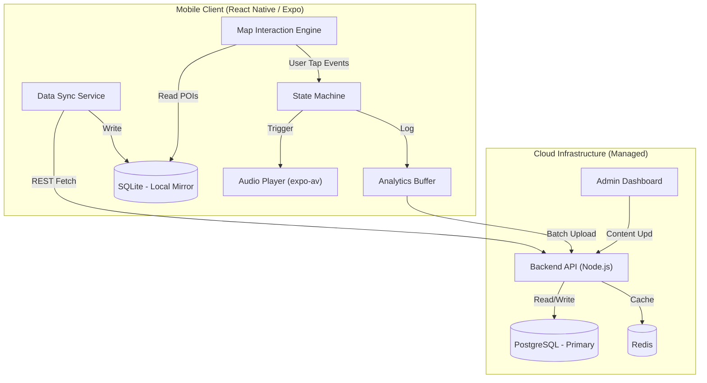

# Architecture & Technical Blueprint

> **Audience**: AI Agents, System Architects, Senior Developers
>
> **Purpose**: Definitive source of truth for the system's technical implementation. This document maps high-level constraints to specific code structures and libraries.

---

## 1. System Topology

The system operates as a **Hybrid Offline-first Mobile Architecture**.



---

## 2. Technology Stack & Libraries (STRICT)

### 2.1 Mobile Client (Consumer)
- **Framework**: `React Native 0.81.x` (Expo SDK 54)
- **Language**: TypeScript 5.0+
- **Key Libraries**:
  - `expo-location`: Foreground location tracking (for blue dot only).
  - `expo-sqlite`: Local offline database.
  - `expo-av`: **Exclusive** audio playback mechanism for pre-generated audio files.
  - `zustand`: Global state management.
  - `react-native-maps`: Map display and POI marker interactions.

### 2.2 Backend API (Provider)
- **Runtime**: `Node.js 20+`
- **Database**:
  - `PostgreSQL` + `PostGIS`: Stores POIs, Users, Telemetry, and Geospatial Data.
  - **Storage**: AWS S3 or Local File System for storing generated `.mp3` audio files.
- **Background Jobs**: Dedicated worker process/queue for TTS generation.

---

## 3. Component Deep-Dive

### 3.1 The Interactive Map Engine
> **Constraint**: Handles displaying locations and routing taps to audio.

- **Process**:
  1. Renders `react-native-maps` using POI coordinates fetched from SQLite.
  2. Tracks user location via `expo-location` in the foreground.
  3. When a marker is tapped, displays the bottom sheet.
  4. Dispatches an explicitly User-Triggered `PLAY_EVENT` to the State Machine when "Listen" is pressed.

### 3.2 The Narration State Machine
> **Constraint**: Handles the "Single Voice Rule".

**States**:
- `IDLE`: No active audio.
- `PLAYING`: Audio file is actively playing.
- `PAUSED`: User temporarily paused audio.

**Transitions**:
- `IDLE` -> `PLAY_EVENT(New POI)` -> `PLAYING`
- `PLAYING` -> `PAUSE_EVENT` -> `PAUSED`
- `PAUSED` -> `RESUME_EVENT` -> `PLAYING`
- `PLAYING` / `PAUSED` -> `STOP_EVENT` -> `IDLE`
- `PLAYING` -> `PLAY_EVENT(New POI)` -> `IDLE` (kills old audio) -> `PLAYING (New POI)`

### 3.3 Backend TTS Processing
1. Admin creates or updates a POI with text descriptions in multiple languages.
2. Backend triggers a background job (or synchronous flow if lightweight) calling a Cloud TTS API (e.g., Google TTS).
3. Backend receives the generated `.mp3` files.
4. Files are saved to S3/Local Storage.
5. The `audio_url` is saved to the PostgreSQL database for each language.

### 3.4 Data Synchronization (The "One-Load" Pattern)
- **Flow**:
  1. `GET /api/v1/sync/manifest`
  2. If ServerVersion > LocalVersion -> `GET /api/v1/sync/full`.
  3. **Atomic Replace** in SQLite.
  4. Audio files are downloaded/cached by the client for offline playback.

---

## 4. Data Models (TypeScript Interfaces)

### 4.1 POI Object (PostgreSQL Table Structure)
```sql
CREATE TABLE points_of_interest (
  id UUID PRIMARY KEY DEFAULT gen_random_uuid(),
  name_jsonb JSONB NOT NULL,
  description_jsonb JSONB NOT NULL,
  audio_urls_jsonb JSONB NOT NULL, -- { "vi": "url_to_mp3", "en": "url_to_mp3" }
  latitude float8 NOT NULL,
  longitude float8 NOT NULL,
  type VARCHAR(50) NOT NULL
);
```

### 4.2 Telemetry Packet
```typescript
interface UserTelemetry {
  deviceId: string; 
  interactions: {
    poiId: string;
    action: "PLAY" | "PAUSE" | "STOP";
    durationMs: number;
    timestamp: number;
  }[];
}
```

---

## 5. Security & Payment Architecture

### 5.1 Payment Flow (Momo/VNPay)
1. Mobile App sends `OrderRequest`.
2. Backend generates `paymentUrl`.
3. Mobile App opens WebView.
4. Deep link callback `phoamthuc://payment-result?status=success`.

---

## 6. Development Guidelines for Agents

1. **When coding the Mobile App**:
   - Audio is strictly triggered by UI buttons. Never by GPS coordinates.
   - Use `expo-av` to play the pre-generated audio files.
   - NEVER query the API for POI data during exploration.

2. **When coding the Backend**:
   - Ensure the TTS generation does not block the main HTTP thread (use a simple worker queue or fast async await).
   - Use a uniform naming convention for generated audio files.

**End of ARCHITECTURE**
