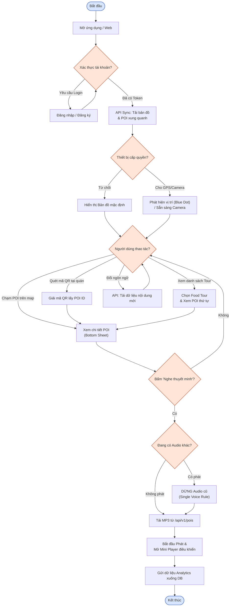
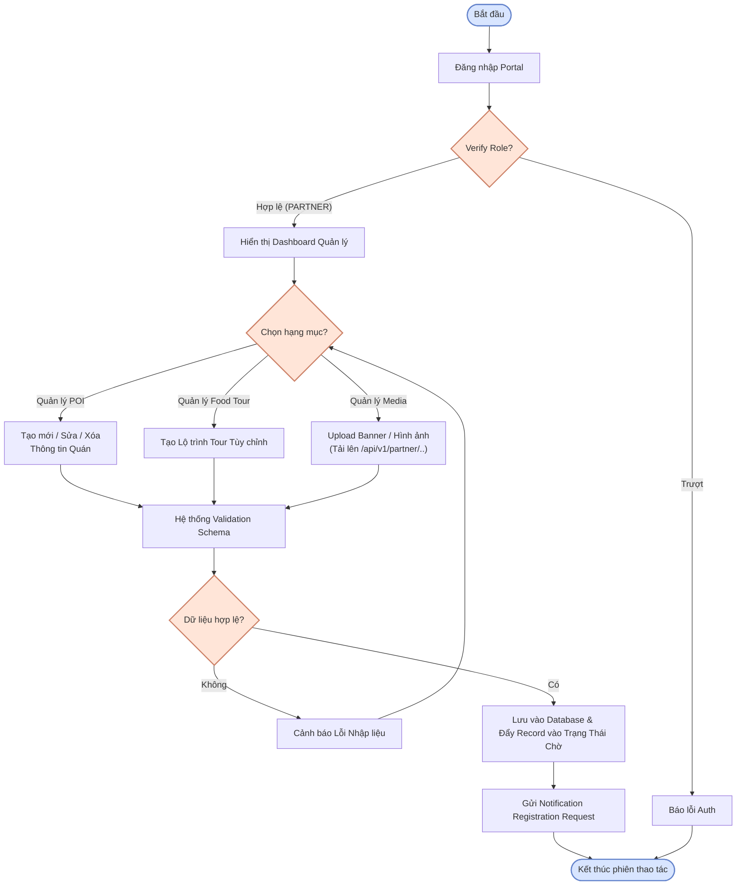
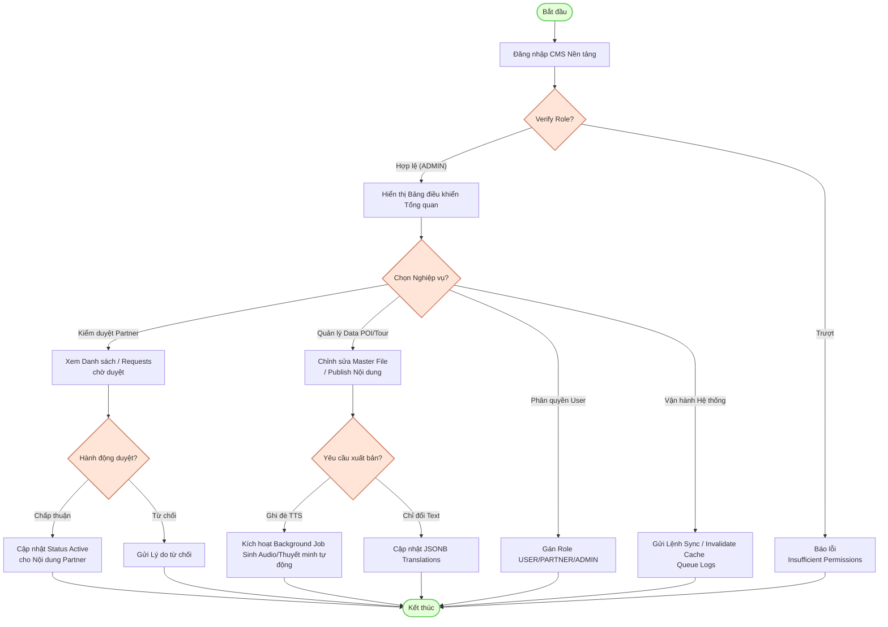

# Activity Diagram

Source: `apps/backend/src/routes/api/auth.ts`, `apps/backend/src/routes/api/pois.ts`, `apps/backend/src/routes/api/tours.ts`, `apps/backend/src/routes/api/sync.ts`, `apps/backend/src/routes/api/users.ts`, `apps/backend/src/routes/api/partner.ts`, `apps/backend/src/routes/api/admin.ts`, `apps/backend/src/routes/api/analytics.ts`

## USER

## PARTNER

## ADMIN

