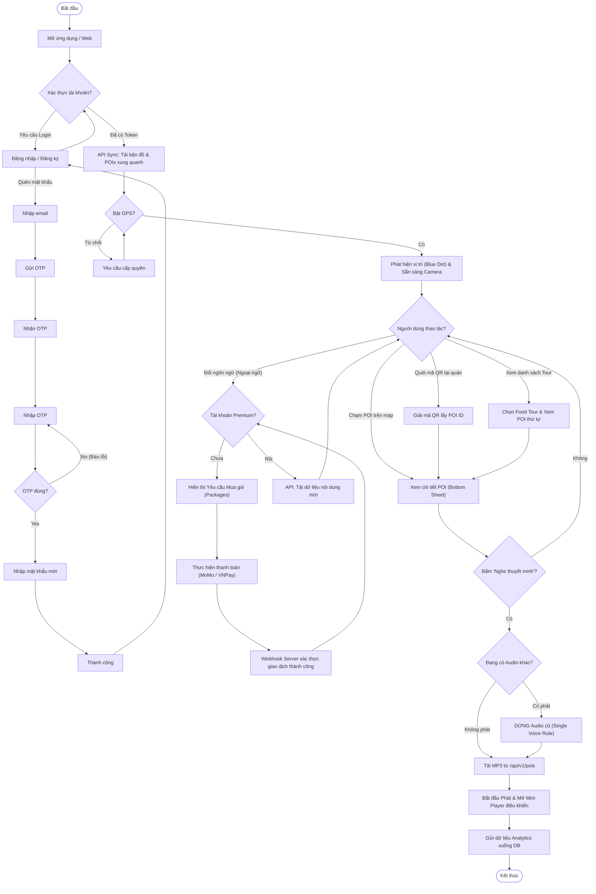
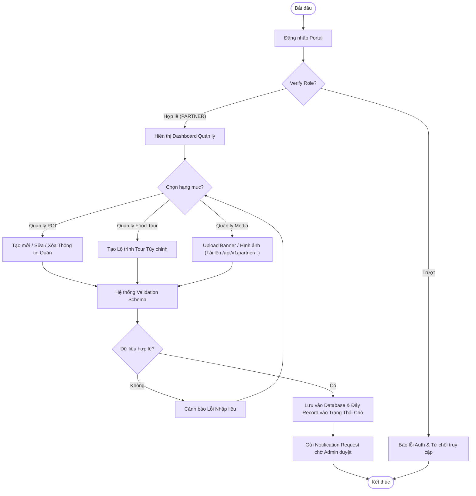
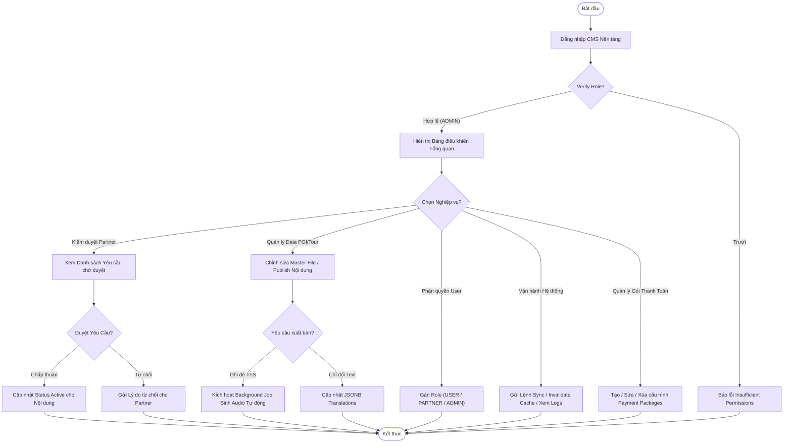

# Activity Diagram

Source: `apps/backend/src/routes/api/auth.ts`, `apps/backend/src/routes/api/pois.ts`, `apps/backend/src/routes/api/tours.ts`, `apps/backend/src/routes/api/sync.ts`, `apps/backend/src/routes/api/users.ts`, `apps/backend/src/routes/api/partner.ts`, `apps/backend/src/routes/api/admin.ts`, `apps/backend/src/routes/api/analytics.ts`

## USER (Khách hàng / Foodie)
Sơ đồ hoạt động của Người dùng với mô hình tương tác "Tap-to-play".

## PARTNER (Đối tác / Chủ quán)
Sơ đồ hoạt động từ việc đăng nhập Dashboard để quản lý địa điểm POI và Tour tuyến độc quyền.

## ADMIN (Quản trị viên)
Sơ đồ vận hành toàn quyền của Quản trị viên, bao gồm việc duyệt yêu cầu Partner, đồng bộ hệ thống và phân quyền.

