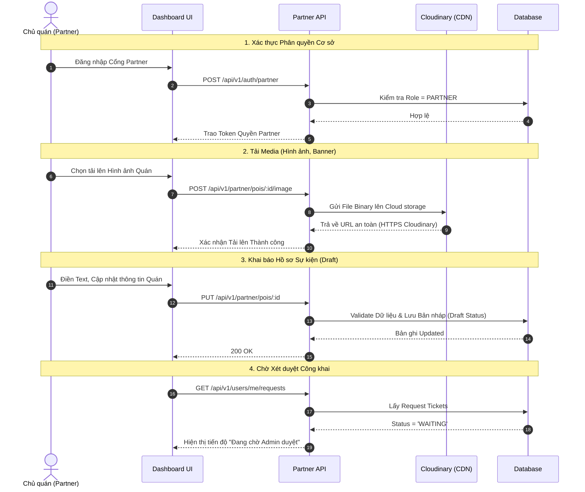
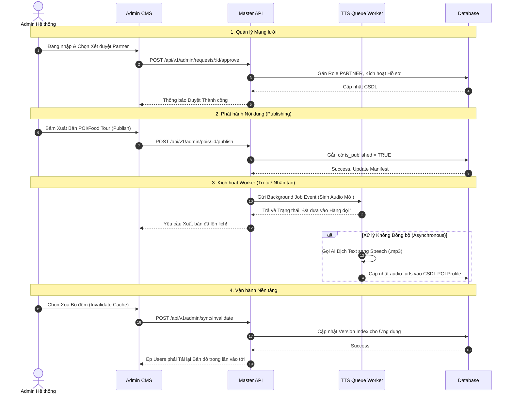

# Sequence Diagram

Source: `auth.ts`, `pois.ts`, `tours.ts`, `sync.ts`, `partner.ts`, `admin.ts`, `poiAdminService.ts`, `ttsService.ts`, `analytics.ts`, `users.ts`

## USER

```mermaid
sequenceDiagram
    autonumber
    actor P as Chủ quán (Partner)
    participant Portal as Dashboard UI
    participant API as Partner API
    participant Img as Cloudinary (CDN)
    participant DB as Database

    Note over P,DB: 1. Xác thực Phân quyền Cơ sở
    P->>Portal: Đăng nhập Cổng Partner
    Portal->>API: POST /api/v1/auth/partner
    API->>DB: Kiểm tra Role = PARTNER
    DB-->>API: Hợp lệ
    API-->>Portal: Trao Token Quyền Partner

    Note over P,DB: 2. Tải Media (Hình ảnh, Banner)
    P->>Portal: Chọn tải lên Hình ảnh Quán
    Portal->>API: POST /api/v1/partner/pois/:id/image
    API->>Img: Gửi File Binary lên Cloud storage
    Img-->>API: Trả về URL an toàn (HTTPS Cloudinary)
    API-->>Portal: Xác nhận Tải lên Thành công

    Note over P,DB: 3. Khai báo Hồ sơ Sự kiện (Draft)
    P->>Portal: Điền Text, Cập nhật thông tin Quán
    Portal->>API: PUT /api/v1/partner/pois/:id
    API->>DB: Validate Dữ liệu & Lưu Bản nháp (Draft Status)
    DB-->>API: Bản ghi Updated
    API-->>Portal: 200 OK

    Note over P,DB: 4. Chờ Xét duyệt Công khai
    Portal->>API: GET /api/v1/users/me/requests
    API->>DB: Lấy Request Tickets
    DB-->>API: Status = 'WAITING'
    API-->>Portal: Hiện thị tiến độ "Đang chờ Admin duyệt"
```

## ADMIN

```mermaid
sequenceDiagram
    autonumber
    actor A as Admin Hệ thống
    participant CMS as Admin CMS
    participant Core as Master API
    participant TTS as TTS Queue Worker
    participant DB as Database

    Note over A,DB: 1. Quản lý Mạng lưới
    A->>CMS: Đăng nhập & Chọn Xét duyệt Partner
    CMS->>Core: POST /api/v1/admin/requests/:id/approve
    Core->>DB: Gán Role PARTNER, Kích hoạt Hồ sơ
    DB-->>Core: Cập nhật CSDL
    Core-->>CMS: Thông báo Duyệt Thành công

    Note over A,DB: 2. Phát hành Nội dung (Publishing)
    A->>CMS: Bấm Xuất Bản POI/Food Tour (Publish)
    CMS->>Core: POST /api/v1/admin/pois/:id/publish
    Core->>DB: Gắn cờ is_published = TRUE
    DB-->>Core: Success, Update Manifest
    
    Note over A,DB: 3. Kích hoạt Worker (Trí tuệ Nhân tạo)
    Core->>TTS: Gửi Background Job Event (Sinh Audio Mới)
    TTS-->>Core: Trả về Trạng thái "Đã đưa vào Hàng đợi"
    Core-->>CMS: Yêu cầu Xuất bản đã lên lịch!
    
    alt Xử lý Không Đồng bộ (Asynchronous)
        TTS->>TTS: Gọi AI Dịch Text sang Speech (.mp3)
        TTS->>DB: Cập nhật audio_urls vào CSDL POI Profile
    end

    Note over A,DB: 4. Vận hành Nền tảng
    A->>CMS: Chọn Xóa Bộ đệm (Invalidate Cache)
    CMS->>Core: POST /api/v1/admin/sync/invalidate
    Core->>DB: Cập nhật Version Index cho Ứng dụng
    DB-->>Core: Success
    Core-->>CMS: Ép Users phải Tải lại Bản đồ trong lần vào tới
```
