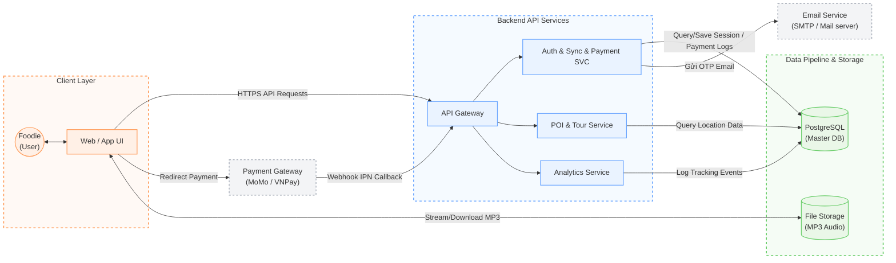
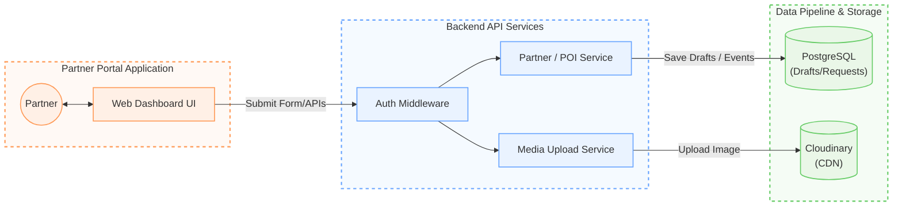
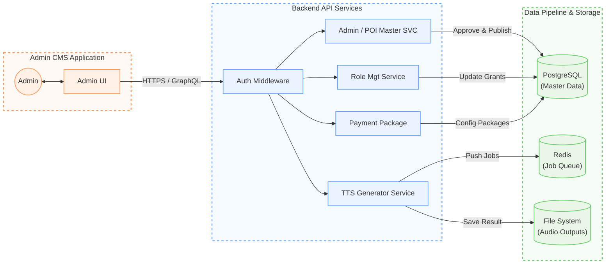

# System Architecture Flow

Source: `apps/backend/src/index.ts`, route files, service files

## USER (Khách hàng / Foodie)

```mermaid
flowchart LR
    %% Subgraphs representing the boxes in the image
    subgraph Client ["Client Layer"]
        direction LR
        U(("Foodie<br>(User)")) <--> W["Web / App UI"]
    end

    subgraph Backend ["Backend API Services"]
        direction TB
        API["API Gateway"]
        AuthSVC["Auth & Sync & Payment SVC"]
        POISVC["POI & Tour Service"]
        AnaSVC["Analytics Service"]
        
        API --> AuthSVC
        API --> POISVC
        API --> AnaSVC
    end

    subgraph DB ["Data Pipeline & Storage"]
        direction TB
        PG[("PostgreSQL<br>(Master DB)")]
        FS[("File Storage<br>(MP3 Audio)")]
    end
    
    PaymentGateway["Payment Gateway<br>(MoMo / VNPay)"]
    EmailService["Email Service<br>(SMTP / Mail server)"]

    W -- "HTTPS API Requests" --> API
    W -- "Redirect Payment" --> PaymentGateway
    PaymentGateway -- "Webhook IPN Callback" --> API

    AuthSVC -- "Query/Save Session / Payment Logs" --> PG
    AuthSVC -- "Gửi OTP Email" --> EmailService
    POISVC -- "Query Location Data" --> PG
    AnaSVC -- "Log Tracking Events" --> PG
    
    W <-- "Stream/Download MP3" --> FS

    %% CSS matches Orange (Client), Blue (Backend), Green (DB)
    classDef client fill:#FFF0E6,stroke:#FF9955,stroke-width:1.5px,color:#333;
    classDef backend fill:#EAF3FF,stroke:#66A3FF,stroke-width:1.5px,color:#333;
    classDef database fill:#EAF7E8,stroke:#66CC66,stroke-width:1.5px,color:#333;
    classDef external fill:#F3F4F6,stroke:#9CA3AF,stroke-width:1.5px,color:#333,stroke-dasharray: 4 4;

    class U,W client;
    class API,AuthSVC,POISVC,AnaSVC backend;
    class PG,FS database;
    class PaymentGateway,EmailService external;
    
    style Client fill:#FFF9F5,stroke:#FF9955,stroke-width:2px,color:#333,stroke-dasharray: 5 5
    style Backend fill:#F5FAFF,stroke:#66A3FF,stroke-width:2px,color:#333,stroke-dasharray: 5 5
    style DB fill:#F5FCF5,stroke:#66CC66,stroke-width:2px,color:#333,stroke-dasharray: 5 5
```

## PARTNER (Đối tác / Chủ quán)

```mermaid
flowchart LR
    subgraph Client ["Partner Portal Application"]
        direction LR
        P(("Partner")) <--> W["Web Dashboard UI"]
    end

    subgraph Backend ["Backend API Services"]
        direction TB
        AuthSVC["Auth Middleware"]
        PartnerSVC["Partner / POI Service"]
        UploadSVC["Media Upload Service"]
        
        AuthSVC --> PartnerSVC
        AuthSVC --> UploadSVC
    end

    subgraph DB ["Data Pipeline & Storage"]
        direction TB
        PG[("PostgreSQL<br>(Drafts/Requests)")]
        CDN[("Cloudinary<br>(CDN)")]
    end

    W -- "Submit Form/APIs" --> AuthSVC

    PartnerSVC -- "Save Drafts / Events" --> PG
    UploadSVC -- "Upload Image" --> CDN

    %% Styling
    classDef client fill:#FFF0E6,stroke:#FF9955,stroke-width:1.5px,color:#333;
    classDef backend fill:#EAF3FF,stroke:#66A3FF,stroke-width:1.5px,color:#333;
    classDef database fill:#EAF7E8,stroke:#66CC66,stroke-width:1.5px,color:#333;

    class P,W client;
    class AuthSVC,PartnerSVC,UploadSVC backend;
    class PG,CDN database;
    
    style Client fill:#FFF9F5,stroke:#FF9955,stroke-width:2px,color:#333,stroke-dasharray: 5 5
    style Backend fill:#F5FAFF,stroke:#66A3FF,stroke-width:2px,color:#333,stroke-dasharray: 5 5
    style DB fill:#F5FCF5,stroke:#66CC66,stroke-width:2px,color:#333,stroke-dasharray: 5 5
```

## ADMIN (Quản trị viên)

```mermaid
flowchart LR
    subgraph Client ["Admin CMS Application"]
        direction LR
        A(("Admin")) <--> W["Admin UI"]
    end

    subgraph Backend ["Backend API Services"]
        direction TB
        AuthSVC["Auth Middleware"]
        AdminSVC["Admin / POI Master SVC"]
        TTSSVC["TTS Generator Service"]
        UserSVC["Role Mgt Service"]
        PaymentAdminSVC["Payment Package"]
        
        AuthSVC --> AdminSVC
        AuthSVC --> TTSSVC
        AuthSVC --> UserSVC
        AuthSVC --> PaymentAdminSVC
    end

    subgraph DB ["Data Pipeline & Storage"]
        direction TB
        PG[("PostgreSQL<br>(Master Data)")]
        Redis[("Redis<br>(Job Queue)")]
        FS[("File System<br>(Audio Outputs)")]
    end

    W -- "HTTPS / GraphQL" --> AuthSVC

    AdminSVC -- "Approve & Publish" --> PG
    TTSSVC -- "Push Jobs" --> Redis
    TTSSVC -- "Save Result" --> FS
    UserSVC -- "Update Grants" --> PG
    PaymentAdminSVC -- "Config Packages" --> PG

    %% Styling
    classDef client fill:#FFF0E6,stroke:#FF9955,stroke-width:1.5px,color:#333;
    classDef backend fill:#EAF3FF,stroke:#66A3FF,stroke-width:1.5px,color:#333;
    classDef database fill:#EAF7E8,stroke:#66CC66,stroke-width:1.5px,color:#333;

    class A,W client;
    class AuthSVC,AdminSVC,TTSSVC,UserSVC,PaymentAdminSVC backend;
    class PG,Redis,FS database;
    
    style Client fill:#FFF9F5,stroke:#FF9955,stroke-width:2px,color:#333,stroke-dasharray: 5 5
    style Backend fill:#F5FAFF,stroke:#66A3FF,stroke-width:2px,color:#333,stroke-dasharray: 5 5
    style DB fill:#F5FCF5,stroke:#66CC66,stroke-width:2px,color:#333,stroke-dasharray: 5 5
```
