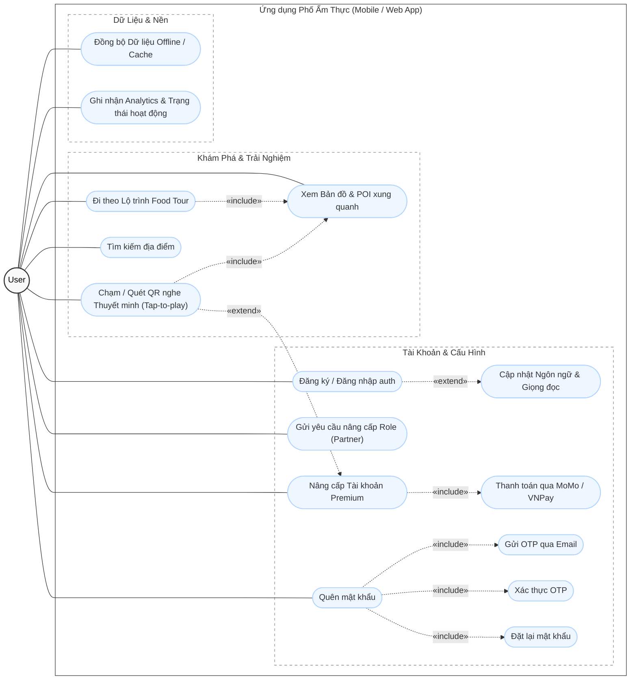
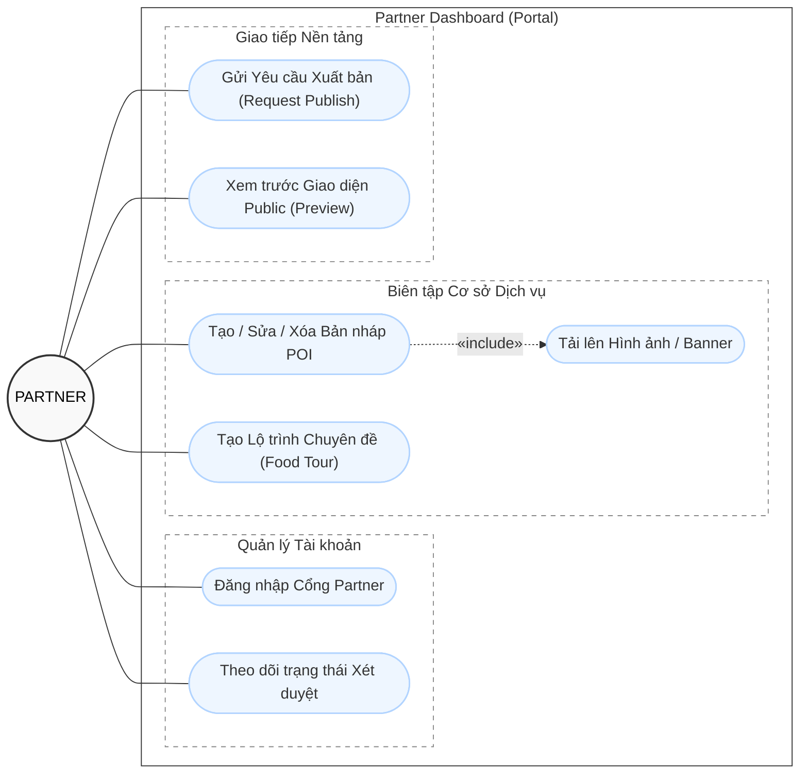
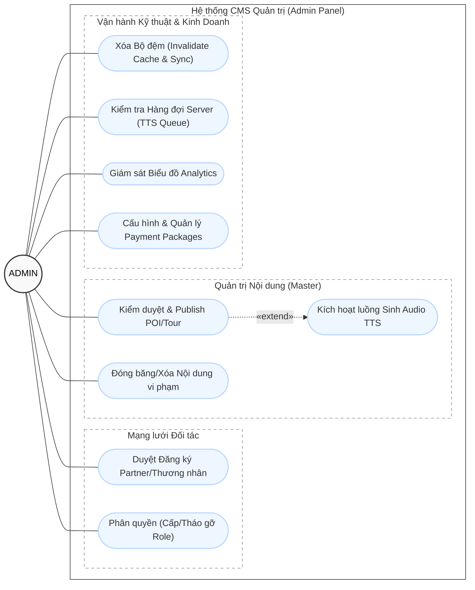

# Use-case Diagram

Source: `apps/backend/src/routes/api/*.ts`

## USER (Khách hàng / Foodie)

```mermaid
flowchart LR
    %% Actor
    USER(("User"))

    subgraph System ["Ứng dụng Phố Ẩm Thực (Mobile / Web App)"]
        
        subgraph Group1 ["Tài Khoản & Cấu Hình"]
            UC1(["Đăng ký / Đăng nhập auth"])
            UC2(["Cập nhật Ngôn ngữ & Giọng đọc"])
            UC3(["Gửi yêu cầu nâng cấp Role (Partner)"])
            UC10(["Nâng cấp Tài khoản Premium"])
            UC11(["Thanh toán qua MoMo / VNPay"])
            UC12(["Quên mật khẩu"])
            UC13(["Gửi OTP qua Email"])
            UC14(["Xác thực OTP"])
            UC15(["Đặt lại mật khẩu"])
            
            UC1 -. "«extend»" .-> UC2
            UC10 -. "«include»" .-> UC11
            UC12 -. "«include»" .-> UC13
            UC12 -. "«include»" .-> UC14
            UC12 -. "«include»" .-> UC15
        end

        subgraph Group2 ["Khám Phá & Trải Nghiệm"]
            UC4(["Xem Bản đồ & POI xung quanh"])
            UC5(["Chạm / Quét QR nghe Thuyết minh (Tap-to-play)"])
            UC6(["Đi theo Lộ trình Food Tour"])
            UC7(["Tìm kiếm địa điểm"])
            
            UC5 -. "«include»" .-> UC4
            UC6 -. "«include»" .-> UC4
            UC5 -. "«extend»" .-> UC10
        end

        subgraph Group3 ["Dữ Liệu & Nền"]
            UC8(["Đồng bộ Dữ liệu Offline / Cache"])
            UC9(["Ghi nhận Analytics & Trạng thái hoạt động"])
        end
    end

    %% Connections
    USER --- UC1
    USER --- UC3
    USER --- UC4
    USER --- UC5
    USER --- UC6
    USER --- UC7
    USER --- UC8
    USER --- UC9
    USER --- UC10
    USER --- UC12

    %% Styling matches the reference image
    classDef actor fill:#f9f9f9,stroke:#333,stroke-width:2px,color:#000
    classDef usecase fill:#EEF6FF,stroke:#B2D4FF,stroke-width:1.5px,color:#333
    class USER actor
    class UC1,UC2,UC3,UC4,UC5,UC6,UC7,UC8,UC9,UC10,UC11,UC12,UC13,UC14,UC15 usecase
    
    style System fill:transparent,stroke:#333,stroke-width:1px,color:#333
    style Group1 fill:transparent,stroke:#888,stroke-width:1px,color:#333,stroke-dasharray: 5 5
    style Group2 fill:transparent,stroke:#888,stroke-width:1px,color:#333,stroke-dasharray: 5 5
    style Group3 fill:transparent,stroke:#888,stroke-width:1px,color:#333,stroke-dasharray: 5 5
```

## PARTNER (Đối tác / Chủ quán)

```mermaid
flowchart LR
    PARTNER(("PARTNER"))

    subgraph System ["Partner Dashboard (Portal)"]
        
        subgraph Group1 ["Quản lý Tài khoản"]
            UC1(["Đăng nhập Cổng Partner"])
            UC2(["Theo dõi trạng thái Xét duyệt"])
        end

        subgraph Group2 ["Biên tập Cơ sở Dịch vụ"]
            UC3(["Tạo / Sửa / Xóa Bản nháp POI"])
            UC4(["Tải lên Hình ảnh / Banner"])
            UC5(["Tạo Lộ trình Chuyên đề (Food Tour)"])
            
            UC3 -. "«include»" .-> UC4
        end

        subgraph Group3 ["Giao tiếp Nền tảng"]
            UC6(["Gửi Yêu cầu Xuất bản (Request Publish)"])
            UC7(["Xem trước Giao diện Public (Preview)"])
        end
    end

    %% Connections
    PARTNER --- UC1
    PARTNER --- UC2
    PARTNER --- UC3
    PARTNER --- UC5
    PARTNER --- UC6
    PARTNER --- UC7

    %% Styling matches the reference image
    classDef actor fill:#f9f9f9,stroke:#333,stroke-width:2px,color:#000
    classDef usecase fill:#EEF6FF,stroke:#B2D4FF,stroke-width:1.5px,color:#333
    class PARTNER actor
    class UC1,UC2,UC3,UC4,UC5,UC6,UC7 usecase
    
    style System fill:transparent,stroke:#333,stroke-width:1px,color:#333
    style Group1 fill:transparent,stroke:#888,stroke-width:1px,color:#333,stroke-dasharray: 5 5
    style Group2 fill:transparent,stroke:#888,stroke-width:1px,color:#333,stroke-dasharray: 5 5
    style Group3 fill:transparent,stroke:#888,stroke-width:1px,color:#333,stroke-dasharray: 5 5
```

## ADMIN (Quản trị viên)

```mermaid
flowchart LR
    ADMIN(("ADMIN"))

    subgraph System ["Hệ thống CMS Quản trị (Admin Panel)"]
        
        subgraph Group1 ["Mạng lưới Đối tác"]
            UC1(["Duyệt Đăng ký Partner/Thương nhân"])
            UC2(["Phân quyền (Cấp/Tháo gỡ Role)"])
        end

        subgraph Group2 ["Quản trị Nội dung (Master)"]
            UC3(["Kiểm duyệt & Publish POI/Tour"])
            UC4(["Đóng băng/Xóa Nội dung vi phạm"])
            UC5(["Kích hoạt luồng Sinh Audio TTS"])
            
            UC3 -. "«extend»" .-> UC5
        end

        subgraph Group3 ["Vận hành Kỹ thuật & Kinh Doanh"]
            UC6(["Xóa Bộ đệm (Invalidate Cache & Sync)"])
            UC7(["Kiểm tra Hàng đợi Server (TTS Queue)"])
            UC8(["Giám sát Biểu đồ Analytics"])
            UC9(["Cấu hình & Quản lý Payment Packages"])
        end
    end

    %% Connections
    ADMIN --- UC1
    ADMIN --- UC2
    ADMIN --- UC3
    ADMIN --- UC4
    ADMIN --- UC6
    ADMIN --- UC7
    ADMIN --- UC8
    ADMIN --- UC9

    %% Styling matches the reference image
    classDef actor fill:#f9f9f9,stroke:#333,stroke-width:2px,color:#000
    classDef usecase fill:#EEF6FF,stroke:#B2D4FF,stroke-width:1.5px,color:#333
    class ADMIN actor
    class UC1,UC2,UC3,UC4,UC5,UC6,UC7,UC8,UC9 usecase
    
    style System fill:transparent,stroke:#333,stroke-width:1px,color:#333
    style Group1 fill:transparent,stroke:#888,stroke-width:1px,color:#333,stroke-dasharray: 5 5
    style Group2 fill:transparent,stroke:#888,stroke-width:1px,color:#333,stroke-dasharray: 5 5
    style Group3 fill:transparent,stroke:#888,stroke-width:1px,color:#333,stroke-dasharray: 5 5
```
